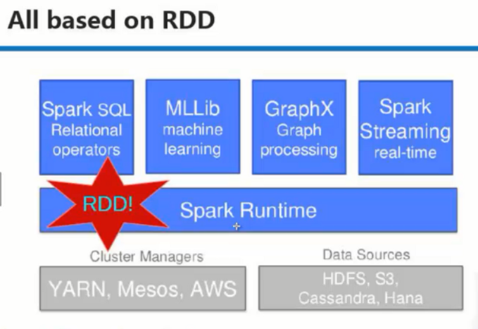

# 第7课：实战解析Spark运行原理和RDD解密
---
标签： sparkIMF

------
Spark适合各种规模的分布式数据的计算（小到5-10台，大到8000台以上规模，比如腾讯，阿里）
当Spark处理的数据大于内存的时候，这个时候其实是可以少量的基于磁盘

##大数据的计算：一站式解决方案
>* 交互式查询（shell,sql）
>* 流处理
>* 批处理（spark内核的RDD直接编程）
>* 同时还包含了机器学习、图计算等内容


Spark整个底层是基于RDD抽象，RDD是通用分布式弹性数据集。

##主要从三个地方理解分布式：
* 分布式，多台机器去运行
[Spark集群](../image/7_1.png)
* 基于内存，如果内存不够可以基于磁盘
* 迭代式计算

##擅长迭代式计算是Spark真正的精髓
根据官方来说，基于磁盘的迭代式分布式系统spark比hadoop快10x倍；基于内存的迭代式分布式系统spark比hadoop快100x倍

##处理数据源：
> HDFS、HBase、Hive、S3、DB


##Spark架构图


##RDD 弹性分布式数据集
>* 弹性之一：自动的进行内存和磁盘数据存储的切换
>* 弹性之二：基于Lineage的高效容错
>* 弹性之三：Task如果失败会自动进行特定次数的重试
>* 弹性之四：Stage如果失败会自动进行特定次数的重试

当Task或Stage失败时，只计算失败的数据分片，如果超出次数还是失败，则全部失败！

##做缓存的时机
>* 计算的步骤特别耗时间
>* 计算链条已经很长，失败的时候代价比较大
>* Shuffle之后
>* CheckPoint之前

##SparkTask代码实战演示

wordCount演示task的生成，可以自行去观察wordCount的运行过程

```scala
//run in spark shell，逐步执行
val data = sc.textFile("hdfs://Master:9000/library/wordcount/input/Data")
data.toDebugString
val flatted = data.flatMap(_.split(" "))
val mapped = flatted.map(word=>(word,1))
mapped.toDebugString
val reduced = mapped.reduceByKey(_+_) 
reduced.toDebugString
reduced.saveAsTextFile("hdfs://Master:9000/library/wordcount/input/Data2")
```


