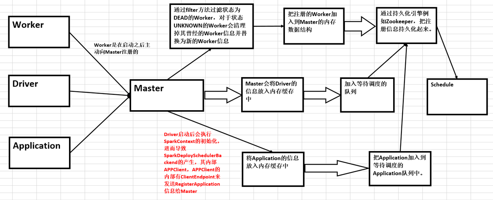

# 第30课：Master的注册机制和状态管理解密

标签： sparkIMF

---

源码是最大的捷径！

技术上，深度决定广度！

越是底层的人越是要求什么都会...

##一：Master对其他组件注册的处理

 1. Master接受注册的对象主要就是：Driver、Application、Worker。需要补充说明的是：Executor不会注册给Master，Executor是注册给Driver中的SchedulerBackend的。
 2. Worker是在启动后主动向Master注册的，所以如果在生产环境下加入新的Worker到已经运行的Spark集群上，此时不需要重新启动Spark集群就能够使用新加入的Worker以提升处理能力。
    ```scala
    case RegisterWorker(
            id, workerHost, workerPort, workerRef, cores, memory, workerUiPort, publicAddress) => {
          logInfo("Registering worker %s:%d with %d cores, %s RAM".format(
            workerHost, workerPort, cores, Utils.megabytesToString(memory)))
          if (state == RecoveryState.STANDBY) {
            context.reply(MasterInStandby)
          } else if (idToWorker.contains(id)) {
            context.reply(RegisterWorkerFailed("Duplicate worker ID"))
          } else {
            val worker = new WorkerInfo(id, workerHost, workerPort, cores, memory,
              workerRef, workerUiPort, publicAddress)
            if (registerWorker(worker)) {
              persistenceEngine.addWorker(worker)
              context.reply(RegisteredWorker(self, masterWebUiUrl))
              schedule()
            } else {
              val workerAddress = worker.endpoint.address
              logWarning("Worker registration failed. Attempted to re-register worker at same " +
                "address: " + workerAddress)
              context.reply(RegisterWorkerFailed("Attempted to re-register worker at same address: "
                + workerAddress))
            }
          }
        }
    ```

 3. Master在接收到Worker注册的请求后，首先会判断一下当前的Master是否是Standby的模式，如果是的话就不处理；然后会判断当前Master的内存数据结构idToWorker中是否已经有该Worker的注册信息，如果有的话此时不会重复注册。
 4. Master如果决定接受注册的Worker，首先会创建WorkerInfo对象来保存注册Worker的信息；
    ```scala
    private[spark] class WorkerInfo(
        val id: String,
        val host: String,
        val port: Int,
        val cores: Int,
        val memory: Int,
        val endpoint: RpcEndpointRef,
        val webUiPort: Int,
        val publicAddress: String)
      extends Serializable{...}
    ```
    然后调用registWorker来执行具体的注册的过程，如果Worker的状态是否是DEAD的状态则直接过滤掉，对于UNKNOWN状态的内容调用removeWorker进行清理（包括清理该Worker下的Executors和Drivers）。
    
 5. 注册的时候是先注册Driver然后再注册Application

###Master接收Worker、Driver、Application注册原理和流程图




##Master对Driver和Executor状态变化的处理

 1. 对Driver状态变化的处理
    ```scala
    case DriverState.ERROR | DriverState.FINISHED | DriverState.KILLED | DriverState.FAILED =>
        removeDriver(driverId, state, exception)
    ```
    
 2. Executor挂掉的时候系统会尝试一定次数的重启（最多重试10次）
    ```scala
    val MAX_NUM_RETRY = 10
    ```
