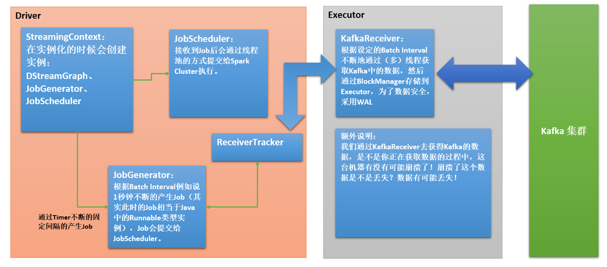

# 第90课：SparkStreaming基于Kafka Receiver案例实战和内幕源码解密

标签： sparkIMF

---

##SparkStreaming On Kafka流程图


##代码实战

SparkStreamingOnKafkaReceiver.java

```java
package com.dtspark.sparkapps.streaming;

import org.apache.spark.SparkConf;
import org.apache.spark.streaming.Durations;
import org.apache.spark.streaming.api.java.*;
import org.apache.spark.streaming.kafka.KafkaUtils;
import scala.Tuple2;

import java.util.Arrays;
import java.util.HashMap;
import java.util.Map;

/**
 * 第90课：SparkStreaming基于Kafka Receiver案例实战和内幕源码解密
 * Created by Limaoran on 2016/7/11.
 */
public class SparkStreamingOnKafkaReceiver {
    public static void main(String[] args) {
        /**
         * 第一步：配置SparkConf：
         * 1，至少两条线程：因为Spark Streaming应用程序在运行的时候，至少有一条
         *  线程用于不断的循环接收数据，并且至少一条线程用于处理接收的数据
         *  （否则的话无法有线程用于处理数据，随着时间的推移，内存和磁盘都会不堪重负）
         * 2，对于集群而言，每个Executor一般肯定不止一个线程，那对于处理Spark Streaming的
         *  应用程序而言，每个Executor一般分配多少Core比较合适呢？根据我们过去的经验，
         *  5个左右的Core是最佳的（一个段子：分配为奇数个Core表现最佳，例如3个、5个、7个Core等）。
         */
        SparkConf conf = new SparkConf().setAppName("WordCountOnlineJ").setMaster("local[4]");
        /**
         * 第二步：创建SparkStreamingContext：
         * 1，这个是Spark Streaming应用程序所有功能的起始点和程序调度的核心。
         * SparkStreamingContext的构建可以基于SparkConf参数，也可以基于持久化的SparkStreamingContext的内容
         *  来恢复过来（典型的场景是Driver崩溃后重新启动，由于Spark Streaming具有连续7*24小时不间断运行的特征，
         *  所以需要在Driver重新启动后继续上一次的状态，此时的状态恢复需要基于曾经的Checkpoint）。
         * 2，在一个Spark Streaming应用程序中可以创建若干个SparkStreamingContext对象，使用下一个SparkStreamingContext
         *  之前需要把前面正在运行的SparkStreamingContext对象关闭掉，由此我们获得一个重大的启发：Spark Streaming框架也只是
         *  Spark Core上的一个应用程序而已，只不过Spark Streaming框架想运行的话需要Spark工程师写业务逻辑处理代码。
         */
        JavaStreamingContext jsc = new JavaStreamingContext(conf, Durations.seconds(10));
        /**
         * 第三步：创建Spark Streaming输入数据来源InputStream：
         * 1，数据输入来源可以基于File、HDFS、Flume、Kafka、Socket等。
         * 2，在这里我们指定数据来源于网络Socket端口，Spark Streaming连接上该端口并在运行的时候一直监听该端口的
         *  数据（当然该端口服务首先必须存在，并且在后续会根据业务需要不断的有数据产生，当然对于Spark Streaming
         *      应用程序的运行而言，有无数据其处理流程都是一样的）。
         * 3，如果经常在每间隔5秒钟没有数据的话不断的启动空的Job其实是会造成调度资源的浪费，因为并没有数据需要发生计算。
         *  所以实际的企业级生产环境的代码在具体提交Job前会判断是否有数据，如果没有的话就不再提交Job。
         *
         * 4，在本案例中具体的参数含义：
         *  第一个参数是StreamingContext实例；
         *  第二个参数是Zookeeper集群信息（接收Kafka数据的时候会从Zookeeper中获取Offset等元数据信息）；
         *  第三个参数是Consumer Group
         *  第四个参数是消费的Topic以及并发读取Topic中Partition的线程数
         */
        Map<String,Integer> topicConsumerConcurrency = new HashMap<>();
        topicConsumerConcurrency.put("HelloKafkaFromSparkStreaming",2);
        JavaPairReceiverInputDStream<String,String> lines = KafkaUtils.createStream(jsc, "MasterWin:2181" ,"MyFirstConsumerGroup",topicConsumerConcurrency);
        /**
         * 第四步：接下来就像对于RDD编程一样，基于DStream进行编程！原因是DStream是RDD产生的模板（或者说类），在Spark Streaming
         *  具体发生计算前，其实质是把每个Batch的DStream的操作翻译成为对RDD的操作！
         * 4.1：对初始的DStream进行Transformation级别的处理，例如map、filter等高阶函数的编程，来进行具体的数据计算。
         *  将每一行的字符串拆分成单个的单词
         */
        JavaDStream<String> words = lines.flatMap(tuple -> Arrays.asList(tuple._2().split(" ")) );
        /**
         * 4.2：在单词拆分的基础上对每个单词实例计数为1，也就是word=>(word,1)
         */
        JavaPairDStream<String,Integer> pairs = words.mapToPair(word -> new Tuple2<String,Integer>(word,1));
        /**
         * 4.3：在每个单词实例计数为1的基础之上统计每个单词在文件中出现的总次数
         */
        JavaPairDStream<String,Integer> wordsCount = pairs.reduceByKey((v1,v2)->v1+v2);
        /**
         * 此处的print并不会直接触发Job的执行，因为现在的一切都是在Spark Streaming框架的控制之下的，
         *  对于Spark Streaming而言具体是否触发真正的Job运行是基于设置的Duration时间间隔的。
         *
         *  诸位一定要注意的是Spark Streaming应用程序要想执行具体的Job，对DStream就必须有output Stream操作，
         *      output Stream有很多类型的函数触发，例如print、saveAsHadoopFiles等，
         *      其实最为重要的一个方法是foreachRDD，因为Spark Streaming处理的结果一般都会放在Redis、DB、DashBoard等上面，
         *      foreachRDD主要就是用来完成这些功能的，而且可以随意的自定义具体的数据到底放在那里！
         */
        wordsCount.print();
//        wordsCount.foreachRDD(pairRDD->{ });
        /**
         * Spark Streaming执行引擎也就是Driver开始运行，Driver启动的时候是位于一条新的线程中的，
         *  当然其内部有消息循环体用于接收应用程序本身或者Executor中的消息。
         */
        jsc.start();

        jsc.awaitTermination();
    }
}
```

##源码阅读

* KafkaUtils
* KafkaInputDStream

